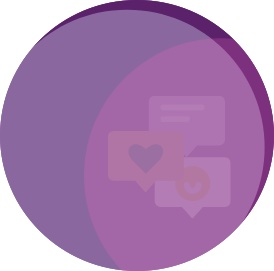

  

<h1 align="center">Super Social</h1>

## Description

Super Social is a social network web application. With Super Social, users can create a friend list, share their thoughts and react to their friends' thoughts.

## Installation

1. Clone this repo to your local device.
2. Enter "npm install" in the CLI to access the npm dependencies.

## Built With

- Mongoose
- Express
- MongoDB

## Website

Here is a [video of Super Social'sfunctionality.](https://watch.screencastify.com/v/Z2WY1lPMyYlIbIRvpX3M).

</a>

## Contribution

Made with ❤️ by Nicole Barranca

## Questions

Feel free to contact me directly at nikkibarranca@gmail.com if you have any questions about the repo.

You can find more of my work at [Nicole Barranca](https://github.com/NicoleBarranca).
